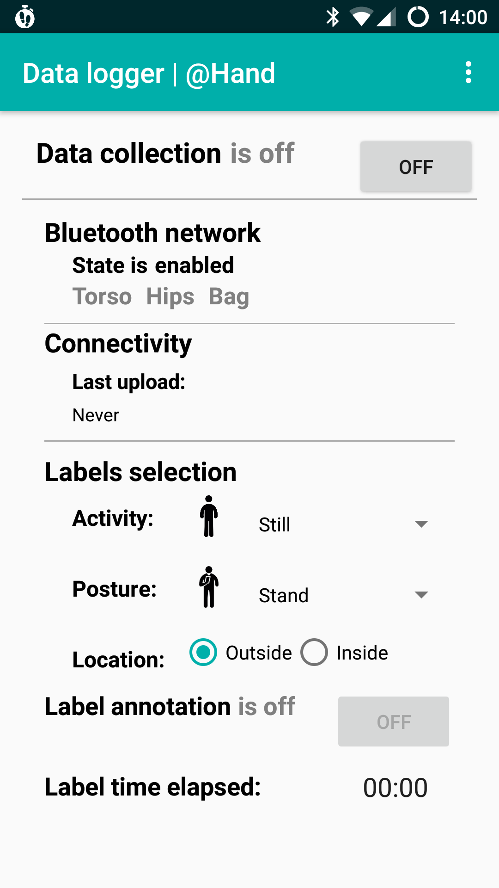
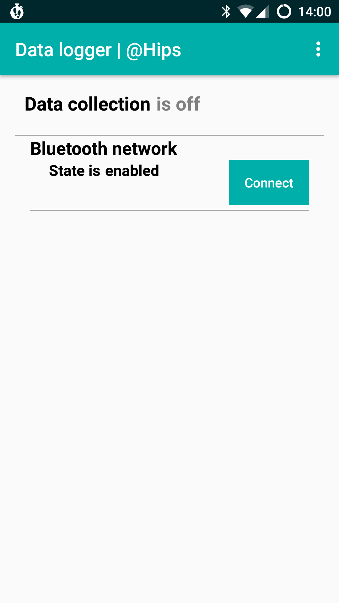

# DataLogger
DataLogger is an high reliability Android application for multidevice multimodal mobile data acquisition and annotation. This application has been developed for research purpose. The usage of this application in research and publications must be acknowledged by citing the following publication:

[1] Mathias Ciliberto, Francisco Javier Ordoñez Morales, Hristijan Gjoreski, Daniel Roggen, Sami Mekki, Stefan Valentin. *"High reliability Android application for multidevice multimodal mobile data acquisition and annotation"* in ACM Conference on Embedded Networked Sensor Systems (Sensys), 2017.

## Functionalities
Application features:
- Logging of sensor data:
  - Inertial sensors data such as accelerometer, gyroscope, magnetometer, as well as software sensors data for linear acceleration, orientation (quaternions), gravity;
  - Environmental sensors data as temperature, light, pressure and humidity;
  - Positioning sensors data such as location and satellites;
  - Networks connectivity data, as network cells and WiFi networks;
  - Battery level
  - Microphone audio
  Every sensors can be configured in the settings to enable/disable it, set the sampling frequency, the remote upload of its data.
- Remote upload of data
- Multidevice (master-slaves) configuration
- Bluetooth connection for synchronization among device of time and status (logging/no logging, labels, sublabels)
- Autostart at boot/reboot
- Background logging using persistent notification
- Logging of data on files (a new file is created at regular interval to reduce data loss)

## Configuration required 
### Settings' password
In order to prevent changes to the setting by the users, the setting menu is protected by a password. It is recommended to change the password in the code before to deploy the application. Set the value of `ADMIN_CODE` in `Constants.java` to change the password before to install the application.

### Master & Slave configuration
It can be configured for collecting data on multiple devices synchronously, in a master-slave configuration. The configuration is set changing the position of the device in the settings. The Hand device is the master, while Hips, Torso and Bag device are the slaves.

 
<table border="0">
  <tr>
    <td border="0">
    
    </td>
    <td border="0">
    
    </td>
  </tr>
</table>

### Remote upload
The remote upload functionality requires to set up the remote address for the upload. The address is in `string.xml` in the value folder.
